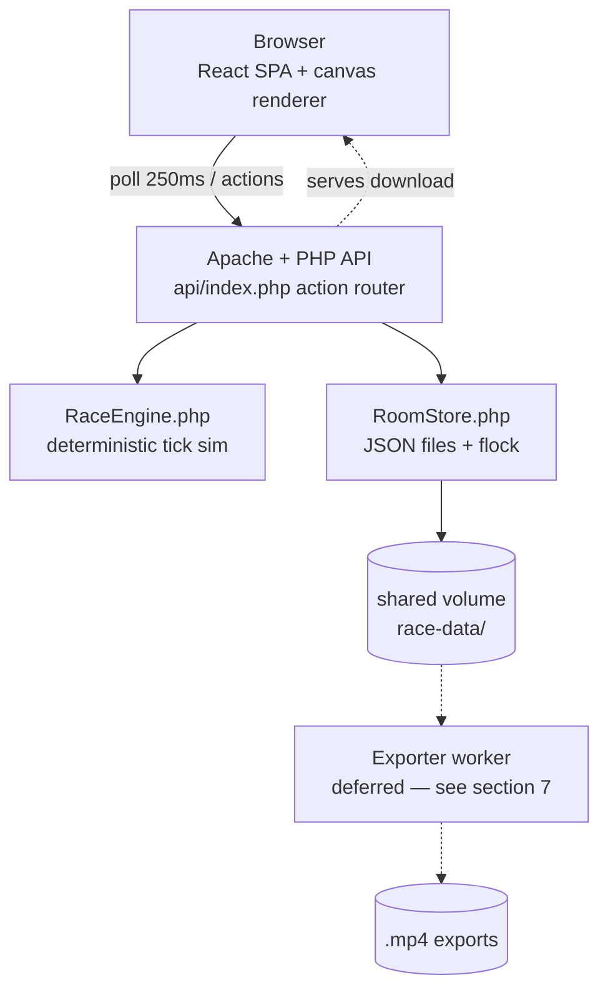

# Spec: Multiplayer Rooms & Backend Race Engine

Status: ready for implementation
Scope: landing page, shareable rooms, server-authoritative races, practice mode, results/rematch, MP4 export, room TTL.

---

## 1. Goal

A landing page offers **Create a Room**. Creating a room produces a unique room
URL (`/?room=<id>`) that can be sent to others. Anyone who opens the link joins
the room with a nickname and sees the **same race** as everyone else. The host
starts the race from a lobby. All race generation and simulation runs in the
backend (PHP). After the race: results and a rematch in the same room. Race
export (MP4) is deferred for now — see §7.

The existing solo experience survives as **Practice mode** with a configurable
number of participants (2–8), running on the same backend simulation.

---

## 2. Locked decisions

| Area | Decision |
| --- | --- |
| Simulation owner | **Server-authoritative.** PHP runs the sim; clients poll and render. |
| Sync mechanism | **Short polling**, every 250 ms (≈1 s when tab hidden). |
| Room storage | **JSON files on disk** (`data/`), `flock` + atomic rename, shared Docker volume. |
| Race start | **Host lobby** with a *Start race* button (min 2 racers). |
| Room identity | 32-hex id (`bin2hex(random_bytes(16))`), URL `/?room=<id>`. |
| Join flow | Nickname required; **dice button** generates a simple word-name. |
| Room size | Host sets **max racers** (2–8) and **max joiners** (racers + spectators). |
| Players → chariots | **Each joiner gets a chariot**, race runs with exactly the joined players (min 2, **no NPC fill**). Joiners past the racer cap (or after start) are **spectators with predictions/bets**. |
| Practice mode | Kept, participant count configurable. **Uses the same PHP sim** (ephemeral room) — one sim implementation only. |
| Post-race | Results screen and **rematch** (host). MP4 export is **deferred** (see §7). |
| Expiry | Rooms expire after **6 hours without interaction**. |
| Deliverable plan | This spec, broken into **stages → steps** for incremental prompting. |
| Stack constraint | **No Node.js / npm / npx anywhere.** Plain JS + JSX in the browser (React UMD + Babel standalone), PHP and HTML/CSS only. |
| Host verification | **No host PHP CLI and no Docker in the editing sandbox.** Stages cannot run `php` or `docker` (see `docs/failed-commands.md`) — code is verified by review; the user runs the app in Docker. |
| Race export | **Deferred** as a core requirement. A reference exporter implementation will be provided later to mimic (still no Node/npm) — see §7. |

Assumptions flagged (say so if wrong):

- *Bets* are bragging-rights only: each participant predicts the winner before
  the start; correct predictors are celebrated at results. No currency.
- If the host leaves, the host token (stored in `localStorage`) keeps host
  powers in that browser. Host hand-off is out of scope for v1.

---

## 3. Architecture



One web container (as today). A future **exporter** container (deferred, see
§7) would join `docker-compose.yml`, sharing the same `race-data` volume.

### What moves from the frontend to PHP

Race logic currently in `public/index.html` — `mulberry32`, `createRace`,
`stepRace` (with `STEP`, `BASE_SPEED`, surge/jitter/band/blocked rules) — is
ported to `api/lib/RaceEngine.php`:

- Deterministic: `createRace(seed)` is a pure function of the seed.
- Fixed timestep (`STEP`), server is the only clock; clients never simulate.
- The PRNG state is **serializable** (mulberry32 keeps one word of state) so the
  server can advance the sim incrementally between requests.
- On every `*_state` request the server **catches up** the sim from stored
  `tick` to *now*, appends the new ticks to the tick history, persists, and
  returns the latest snapshot.
- Clients **interpolate** chariot positions between the two most recent ticks
  for smooth 60 fps rendering; `draw()`, `lanePose()`, `buildTrack()` etc.
  stay in the browser.

### Tick history (for replay & future export)

Each race writes `data/rooms/<roomId>/race-<n>.ticks.jsonl.gz` — one JSON line
per tick: `{tick, t, racers:[{lane, p, done, place}], placements}`. Full
history is kept for every finished race (it will feed the deferred export).

---

## 4. Data model

`data/rooms/<roomId>.json`

```json
{
  "id": "0123456789abcdef0123456789abcdef",
  "createdAt": "2026-10-08T12:00:00+00:00",
  "updatedAt": "2026-10-08T12:03:41+00:00",
  "hostToken": "hex(32 bytes)",
  "config": { "maxRacers": 4, "maxJoiners": 8 },
  "status": "lobby",
  "participants": [
    {
      "id": "hex(8 bytes)",
      "token": "hex(32 bytes)",
      "nickname": "Swift Badger",
      "role": "racer",
      "lane": 0,
      "joinedAt": "2026-10-08T12:01:00+00:00",
      "prediction": null
    }
  ],
  "raceNo": 0,
  "race": null,
  "history": [
    {
      "raceNo": 1,
      "seed": "opaque base64",
      "placements": [{ "lane": 2, "place": 1, "nickname": "Swift Badger" }],
      "predictions": [{ "nickname": "Iron Quill", "pick": 2, "correct": true }],
      "ticks": "race-1.ticks.jsonl.gz"
    }
  ]
}
```

`race` while `status: "racing"`:

```json
{
  "seed": "opaque base64",
  "tick": 812,
  "prngState": 1234567,
  "racers": [{ "lane": 0, "p": 0.73, "done": false, "place": null }],
  "placements": [],
  "startedAt": "…",
  "finishedAt": null
}
```

Practice rooms: `data/practice/<raceId>.json`, same `race` block, no
participants/host/lobby (racers get generated word-names client- or
server-side — server-side, so the export path works for practice too).

Export jobs (deferred with §7): `data/export-jobs/<jobId>.json`
`{jobId, roomId|practiceId, raceNo, status: "queued"|"rendering"|"done"|"error", out: "exports/<jobId>.mp4", error}`.

---

## 5. API contract

All through the existing `api/index.php` router (`?action=…`), JSON in / JSON
out. Errors: HTTP status + `{ "error": { "code": "room_not_found", "message": "…" } }`.

| Action | Method | Body / params | Returns | Notes |
| --- | --- | --- | --- | --- |
| `create_room` | POST | `{maxRacers, maxJoiners}` | `{roomId, hostToken, joinUrl}` | Host = creator. |
| `join_room` | POST | `{roomId, nickname}` | `{participantId, token, role, snapshot}` | 404 unknown/expired; 409 full. Role = `racer` while slots remain, else `spectator`. |
| `leave_room` | POST | `{roomId, token}` | `{ok}` | Racer slots free up before start. |
| `room_state` | GET | `room`, `tick`, `token` | snapshot `{status, tick, participants, race?, history?}` | Poll every 250 ms. `tick` optional → delta of new ticks. |
| `start_race` | POST | `{roomId, hostToken}` | `{ok}` | 403 non-host; 409 &lt;2 racers or already racing. Creates seed, `status: "racing"`. |
| `rematch` | POST | `{roomId, hostToken}` | `{ok}` | New seed, roster kept, `raceNo++`. 403/409 as above. |
| `set_prediction` | POST | `{roomId, token, pick}` | `{ok}` | `pick` = lane; only before start. |
| `create_practice` | POST | `{racers}` | `{practiceId}` | 2–8 racers. Ephemeral, no join. |
| `practice_state` | GET | `race`, `tick` | race snapshot | Same shape as `room_state.race`. |
**Deferred with §7 (export):** `request_export` `{roomId?, practiceId?, raceNo}`
→ `{jobId}`, `export_status` `job` → `{status, url?}`, `export_download` `job`
→ MP4 stream. The action names are reserved; nothing implements them yet.

Retained: `hello`, `health`, `echo`. **Removed** in Stage 7: `seed` (the sim no
longer runs in the browser).

---

## 6. Frontend

Routing via query params (no router library): `/` → landing; `/?room=<id>` →
room; `/?practice=<id>` → practice race. Unknown/expired ids render a
parchment *"This scroll hath turned to dust"* card with a link home.

### Landing page (`/`)

Parchment card, existing palette/buttons from `public/css/main.css`:

- **Create a Room** → small form: *racers* (2–8 slider) and *max joiners*; the
  Create button calls `create_room` and navigates to `/?room=<id>` as host.
- **Join a Room** → code/link input (or just open a shared link) → nickname
  step.
- **Practice** → participant count (2–8) → `create_practice` → race view.

### Join / nickname step (`/?room=<id>` before joining)

- Nickname field + **dice button** that generates a simple word-name from a
  small bundled wordlist (adjective + noun, e.g. *Swift Badger*, *Iron Quill*).
- Join button → `join_room` → lobby (or straight to the race view if racing).

### Lobby

- Roster: racers with their chariot color, spectators marked.
- **Share panel**: full room URL + **Copy link** button (host and everyone else).
- **Prediction picker**: pick the winning chariot (racers + spectators).
- Host-only **Start race** (disabled with &lt;2 racers) showing the roster count.

### Race view (rooms & practice — same component)

- Existing canvas renderer, fed by polled state + interpolation.
- Chariot labels use **nicknames** (rooms) or generated names (practice).
- Late joiners (or reloads) drop into the live race at the current tick.
- Missed polls show a subtle "thine link doth waver" status; recover silently.
- Hidden tab: poll slows to ~1 s (`document.visibilityState`).

### Results

- Placements with existing `ORDINAL` styling, correct predictions highlighted.
- **Race again** (host, rooms) → `rematch`; (practice) → count picker → new race.
- **Export race (MP4)** — deferred with §7; the button slot is reserved here.

---

## 7. Race export (MP4) — DEFERRED

Not a core requirement for now. A reference exporter implementation from
another project will be provided later, and the exporter here will **mimic
that implementation**. Hard constraints that carry over:

- **No Node.js / npm / npx tooling anywhere** — the exporter included. The app
  stack stays plain JS + JSX (React UMD + Babel standalone), PHP and HTML/CSS.
- The output must be a real **MP4** (H.264) built from the stored **tick
  history** of a finished race (§3).
- The reserved API surface is `request_export` / `export_status` /
  `export_download` (§5); the job file shape is in §4.

Until the reference lands: keep writing full tick history for every race
(cheap, gzipped) so nothing has to be re-simulated later, and reserve the
*Export race* button slot on the results screen (§6).

---

## 8. Lifecycle & cleanup

- `updatedAt` bumps on every API touch of a room (polls count as interaction —
  an open tab keeps the room alive).
- **GC rule: 6 hours since `updatedAt`** → delete room JSON, tick histories,
  exports. Practice rooms: same rule.
- GC runs lazily (on `create_room` / `join_room` / `create_practice`) — a cheap
  directory scan; enough for the single-container setup. Expired ids answer
  `404 room_not_found` (UI shows the dust-scroll card).

---

## 9. Security notes

- Room ids are 128-bit random; unguessable-by-construction.
- Host and participant actions require their **tokens** (`random_bytes(32)`,
  hex). Tokens live in `localStorage` per room. Never trust the client for
  simulation state.
- Rate limiting / abuse protection: out of scope (single-node, friendly use).

---

## 10. Stage files

Each stage lives in its own file with small, detailed steps and its own
working rules. Do one stage at a time; prompt with “do Stage N” (or a single
step). Stay inside each stage’s step list — the files say what to build and,
just as importantly, what not to.

| Stage | File | Status |
| --- | --- | --- |
| 1 — Backend race engine + practice slice | [stages/stage-1.md](stages/stage-1.md) | steps done (1.1–1.9), acceptance pending runtime |
| 2 — Landing page & routing | [stages/stage-2.md](stages/stage-2.md) | **done** |
| 3 — Rooms: create, join, lobby | [stages/stage-3.md](stages/stage-3.md) | in progress (3.1–3.2 done) |
| 4 — Multiplayer race + predictions | [stages/stage-4.md](stages/stage-4.md) | not started |
| 5 — Results + rematch | [stages/stage-5.md](stages/stage-5.md) | not started |
| 6 — Custom tracks & racers (spec + questions) | [stages/stage-6.md](stages/stage-6.md) | **spec draft — open questions** |
| 7 — TTL, hardening, docs | [stages/stage-7.md](stages/stage-7.md) | not started |

---

## 11. Edge cases

- **Host closes the tab / loses the token**: the room keeps running; host
  actions are simply unavailable in other browsers (v1). Hand-off = later.
- **Duplicate nicknames**: allowed (ids differ); results distinguish by lane
  color.
- **Racer leaves mid-race**: the chariot finishes as a ghost (sim is
  server-owned); roster marks them *(departed)*.
- **Everyone leaves**: room persists until TTL; sim keeps advancing only when
  polled (document: sim advances on *catch-up*, so a room nobody polls freezes
  at its last tick — acceptable, and it expires by TTL anyway).
- **Two hosts double-click Start**: second call returns `409 already_racing`.
- **Clock skew**: never used; `tick` is the only time axis.

## 12. Out of scope (v1)

Real-currency betting, accounts/login, matchmaking, WebSockets/SSE,
multi-node scaling (file store is single-node), live replays with scrubbing,
host hand-off, spectator chat. Race export is deferred rather than out of
scope (§7).
